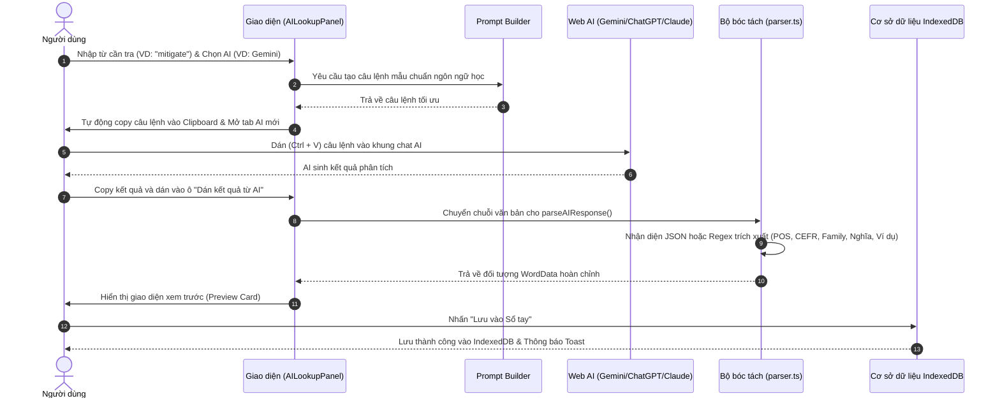
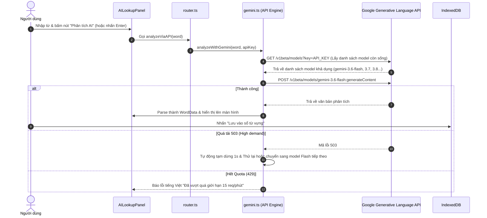

# 🔄 Quy Trình Hoạt Động & Luồng Dữ Liệu (WORKFLOW.md)

Tài liệu này mô tả chi tiết các luồng nghiệp vụ (Workflows) của dự án **Smart Lexicon Notebook**, giải thích rõ cách dữ liệu di chuyển từ lúc người dùng tìm kiếm từ mới cho đến khi lưu trữ và ôn tập theo chu kỳ ngắt quãng (Spaced Repetition).

---

## 1. Luồng 1: Tra cứu bằng AI Chat miễn phí (Free Web Chat Mode)

Đây là chế độ mặc định, hoàn toàn không tốn chi phí và không cần đăng ký API Key.

---

## 2. Luồng 2: Tra cứu tự động 1-Click bằng Gemini API (API Mode)

Dành cho người dùng đã nhập API Key Gemini trong trang Cài đặt.

---

## 3. Luồng 3: Tiện ích mở rộng trình duyệt (Brave / Chrome Extension)

Cho phép người dùng tra nhanh từ bất kỳ website nào khi đang đọc báo, xem tài liệu:

1. **Bôi đen từ vựng:** Người dùng bôi đen một từ tiếng Anh trên trang web bất kỳ.
2. **Kích hoạt:** Nhấp chuột phải chọn *"Tra từ với Smart Lexicon"* hoặc bấm biểu tượng Extension trên thanh công cụ.
3. **Chuyển hướng thông minh:** Extension tự động mở tab `http://localhost:3000/lookup?word={từ_vựng}`.
4. **Phân tích tự động:** Trang `lookup` nhận query param `word`, tự động điền vào ô tìm kiếm và gọi phân tích ngay nếu người dùng đã bật API Mode.

---

## 4. Luồng 4: Ôn tập ngắt quãng thông minh (Spaced Repetition Review)

Dựa trên nguyên lý đường cong lãng quên (Ebbinghaus Forgetting Curve) và hệ thống Leitner:

1. **Thuật toán phân loại:**
   - Hệ thống quét toàn bộ từ trong `IndexedDB`.
   - Các từ chưa thuộc (`isMastered === false`) hoặc có khoảng cách từ lần ôn tập trước (`lastReviewedAt`) vượt quá chu kỳ sẽ được đưa vào hàng đợi ôn tập hôm nay.
2. **Trải nghiệm Flashcard:**
   - **Mặt trước:** Hiển thị Từ tiếng Anh, Phiên âm IPA, Cấp độ CEFR, Câu ví dụ khuyết từ (ẩn từ khóa).
   - **Lật thẻ:** Hiển thị Nghĩa tiếng Việt, Từ loại, Gia đình từ, Từ đồng nghĩa/trái nghĩa, Lỗi sai phổ biến.
3. **Phản hồi người học:**
   - **Chưa nhớ (Again):** Giữ nguyên hoặc giảm cấp độ, đưa lại vào hàng đợi ôn tập sớm.
   - **Đã nhớ (Good / Mastered):** Tăng `reviewCount`, cập nhật `lastReviewedAt = Date.now()`, nếu ôn đủ số lần sẽ đánh dấu `isMastered = true`.

---

## 5. Luồng 5: Sao lưu & Phục hồi dữ liệu (Backup & Restore)

1. **Xuất dữ liệu (Export):**
   - Đọc toàn bộ kho từ vựng từ `IndexedDB` $\rightarrow$ Chuyển thành file định dạng JSON `lexicon-backup-YYYY-MM-DD.json` tải về máy tính.
2. **Nhập dữ liệu (Import):**
   - Đọc file JSON từ máy tính $\rightarrow$ Kiểm tra tính hợp lệ của cấu trúc `WordData` $\rightarrow$ Thực hiện cơ chế Merge an toàn (từ nào đã có thì cập nhật, từ mới thì thêm vào) $\rightarrow$ Không làm mất dữ liệu hiện tại.
